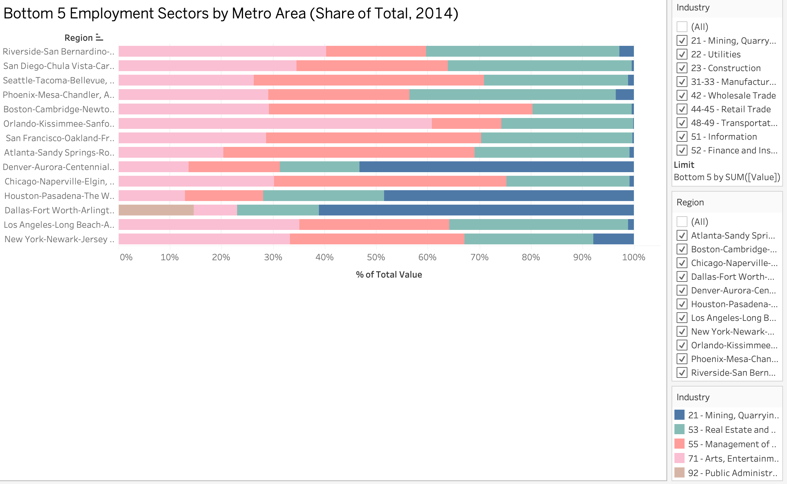
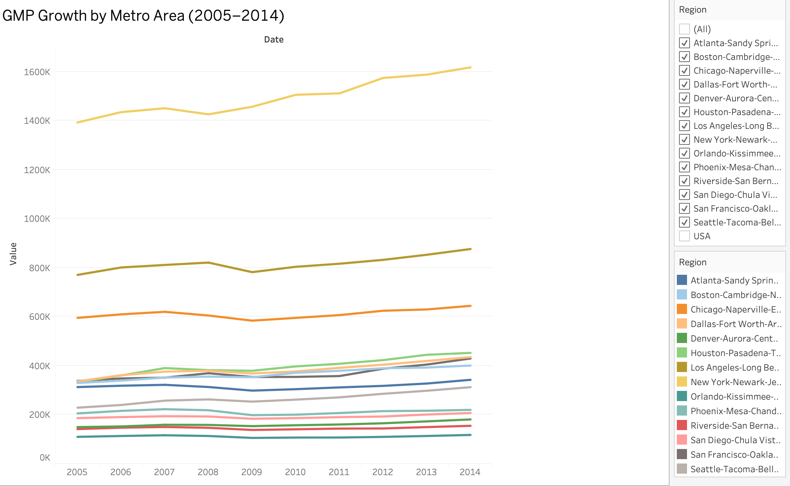
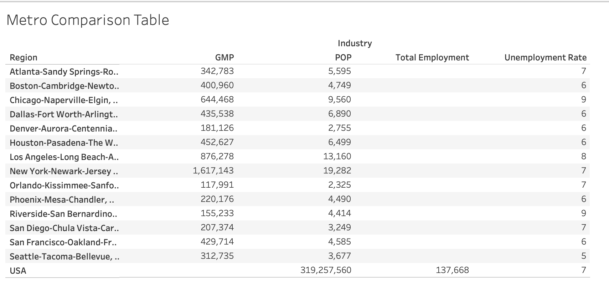

# Software-Tools-Group-1-Project
# Group-Project Final Report 
Group: Grant Hanauer, Nicholas Hoffman, Aurora Seekins, and Hannah Farrell

## Introduction 
A real estate developer is considering opportunities for future investment. For the purpose of this report the real estate developer is Eagles Real Estate Developers. They are a Boston based firm but operate nationally.

The firm, Eagles Real Estate Developers, has already isolated GDP per capita aggregated by Metropolitan Statistical Area level to be a key indicator of long-run performance. Currently the firm lacks a means to forecast GDP per capita but is capable of monitoring employment trends as a guide to future metro level performance. The firm wants to know what are the key employment categories (NAICS-2 Digit) that will drive metro level GDP growth and what are the trends by employment category for major MSAs. This information will then inform what metro areas the firm should invest in to, as these varibles can be predictors for metro-areas that will have contined growth and therefore need housing. 

In additon to the employment category data, information on the housing sales by region have also been downloaded to also inform on the applicable housing markets that are potential options for the firm to invest in. This provides an added layer of information on the health of the relevant hosuing markets. 

The centeral research question for this report is to answer where Eagles Real Estate Developers should invest in, based on the regional labor markets and economic indicators (GDP and employment).

## Data  

The primary data our team is utilizing for this research was sourced indirectly from the Bureau of Economic Analysis (BEA), Bureau of Labor Statistics (BLS), and the US Census Bureau through Federal Reserve Economic Data (FRED). GDP, Population, Unemployment Rate,  Total Employment, Employment by NAICS 2 Digit Category, and other potential variables for Major MSAs on FRED pretty readily. 

In addition to the primary data, this report utilizes an excursion datset of the Federal Housing Finance Agency (FHFA) data to examine whether metro areas with strong employment-driven GDP growth also experience higher housing price appreciation, providing additional context for Eagles Real Estate Developers. The FHFA data serves as an excellent compliment to our existing data because: a) It is also available through FRED, which is ensures the definition of metropolitan area and formatting is as close as possible; b) the data is reliable and government-backed; and c) the data uses repeated sales of the same property, which accurately shows housing price appreciation.

The data has four main variables; Date, Region, Industry, and Value. The industries are the key employment categories which utilize the NAICS-2 Digit code as an identifier. The industry vairble also contains the the population size, employment broken down by sector, the unemployment rate, and GMP for the applicable metro region. The value listed for each column is the specific value. For example, the value of Altanta population indicates the number of people that live in that metro area. While the NAICS-2 values are those for the employment within that category. The below table provides a breakdown of the units and description for each of the variables used in the main dataset for this report.

**Table 1. Dataset Variable Descriptions**
| Metric | Units | Description |
|--------|-------|-------------|
| Employment - 21 - Mining, Quarrying, and Oil and Gas Extraction | Thousands of Persons | Measures the number of employees (in thousands) working in the broader mining, quarrying, oil, and gas industry sector as defined by the North American Industrial Classification System (NAICS). Raw data source: U.S. Bureau of Labor Statistics (BLS) State and Area Employment, Hours, and Earnings dataset via FRED. |
| Employment - 22 - Utilities | Thousands of Persons | Measures the number of employees (in thousands) working in the utilities industry sector as defined by the North American Industrial Classification System (NAICS). Raw data source: U.S. Bureau of Labor Statistics (BLS) State and Area Employment, Hours, and Earnings dataset via FRED. |
| Employment - 23 - Construction | Thousands of Persons | Measures the number of employees (in thousands) working in the construction sector as defined by the North American Industrial Classification System (NAICS). Raw data source: U.S. Bureau of Labor Statistics (BLS) State and Area Employment, Hours, and Earnings dataset via FRED. |
| Employment - 31-33 - Manufacturing | Thousands of Persons | Measures the number of employees (in thousands) working in manufacturing as defined by the North American Industrial Classification System (NAICS). Raw data source: U.S. Bureau of Labor Statistics (BLS) State and Area Employment, Hours, and Earnings dataset via FRED. |
| Employment - 42 - Wholesale Trade | Thousands of Persons | Measures the number of employees (in thousands) working in the wholesale trade industry sector as defined by the North American Industrial Classification System (NAICS). Raw data source: BLS via FRED. |
| Employment - 44-45 - Retail Trade | Thousands of Persons | Measures the number of employees (in thousands) working in the retail trade industry sector as defined by NAICS. Raw data source: BLS via FRED. |
| Employment - 48-49 - Transportation and Warehousing | Thousands of Persons | Measures the number of employees (in thousands) working in logistics (transportation and warehousing) sector as defined by NAICS. Raw data source: BLS via FRED. |
| Employment - 51 - Information | Thousands of Persons | Measures the number of employees (in thousands) working in the information sector as defined by NAICS. Raw data source: BLS via FRED. |
| Employment - 52 - Finance and Insurance | Thousands of Persons | Measures the number of employees (in thousands) working in financial services and insurance sector as defined by NAICS. Raw data source: BLS via FRED. |
| Employment - 53 - Real Estate and Rental and Leasing | Thousands of Persons | Measures the number of employees (in thousands) working in real estate and rental/leasing sector as defined by NAICS. Raw data source: BLS via FRED. |
| Employment - 54 - Professional, Scientific, and Technical Services | Thousands of Persons | Measures the number of employees (in thousands) working in professional, scientific, and technical services sectors as defined by NAICS. Raw data source: BLS via FRED. |
| Employment - 55 - Management of Companies and Enterprises | Thousands of Persons | Measures the number of employees (in thousands) working in management of companies sector as defined by NAICS. Raw data source: BLS via FRED. |
| Employment - 61 - Educational Services | Thousands of Persons | Measures the number of employees (in thousands) working in educational services as defined by NAICS. Raw data source: BLS via FRED. |
| Employment - 62 - Health Care and Social Assistance | Thousands of Persons | Measures the number of employees (in thousands) working in health care and social assistance as defined by NAICS. Raw data source: BLS via FRED. |
| Employment - 71 - Arts, Entertainment, and Recreation | Thousands of Persons | Measures the number of employees (in thousands) working in arts, entertainment, and recreation as defined by NAICS. Raw data source: BLS via FRED. |
| Employment - 72 - Accommodation and Food Services | Thousands of Persons | Measures the number of employees (in thousands) working in accommodation and food services industry as defined by NAICS. Raw data source: BLS via FRED. |
| Employment - 81 - Other Services (except Public Administration) | Thousands of Persons | Measures employment in miscellaneous private-sector services not classified elsewhere under NAICS. Raw data source: BLS via FRED. |
| Employment - 92 - Public Administration | Thousands of Persons | Measures employment in government (state, local, federal) under NAICS. Raw data source: BLS via FRED. |
| Total Employment | Thousands of Persons | Total number of employed persons across all industries in the geographic area. Raw data source: BLS LAUS via FRED. |
| Unemployment Rate | Percent (Not Seasonally Adjusted) | Share of labor force that is unemployed but actively seeking work. Raw data source: BLS LAUS via FRED. |
| Gross Metro Product (GMP) | Millions of Chained 2017 Dollars (Not Seasonally Adjusted) | Total economic output of a metropolitan area. Raw data source: BEA via FRED. |
| US GDP (GDPC1) | Billions of Chained 2017 Dollars (Seasonally Adjusted) | Real GDP of the United States. Raw data source: BEA via FRED. |
| Population | Thousands of Persons | Total resident population of the geographic area. Raw data source: U.S. Census Bureau via FRED. |

## Data Summary 

The data includes information for fourteen (14) major metro areas as well as the United States as a whole, including the metro areas for the following states; Georgia, Massachusetts & New Hampshire, Illinois & Indiana, Texas, Colorado, Michigan, California, Florida, Minnesota & Wisconsin, New York & New Jersey, Pennsylvania & Maryland & Delaware, Arizona, Washington, and Washington DC & Virginia & West Virginia and Maryland.

The dataset is on an annual level for 2005 to 2014. The variables for each metro area include; the population size, employment broken down by sector, the unemployment rate, and GMP. The employment values for each subcategory are provided in thousands of jobs for that category of employment for the year.  
 
### Brief Data Summary: Primary Data - Economic Indicators by Region

**Table 2. Dataset Dimensions**

There are 4 rows and 3290 columns in the dataset.

**Table 3. Summary Statistics for Employment Values(Thousands of People)**

 

**Table 4. Distribution of Total Employment by Region** 

**Table 5. Summary Statistics for Industry Employment**

Table 5 inclues the summary statitics by industry across all of the regions broken down by employment category. 

**Table 6. Summary Statistics for Macro Variables**

### Brief Data Summary: Excursion Data - Housing Price Indicators (HPI) by Region

**Table 7. Housing Price Index (HPI) Dataset Dimensions**

There are 150 rows and 6 columns in hte excusion dataset.

**Table 8. Summary Statistics for for Housing Price Index**
 

Table 8 inclues the summary statitics by industry across all of the regions and the USA in total for the HPI. 

**Table 9. Metro Area HPI Trends**

## Data Analytics

The visualizations provide a comparative view of economic structure and performance across major U.S. metropolitan areas using employment composition, output (GMP), and labor market indicators. The metro comparison table highlights large differences in economic scale across regions. New York stands out with the highest GMP (around 1.6 million), followed by Los Angeles and Chicago, indicating their dominant role in national economic output. However, unemployment rates do not scale directly with size. For example, Chicago and Riverside both show higher unemployment rates near 9 percent, while Seattle has the lowest at around 5 percent despite a smaller overall economy. This suggests that labor market efficiency is not solely dependent on economic size.

The GMP growth visualization from 2005 to 2014 shows that all metros experienced a decline around 2008–2009, consistent with the financial crisis. Recovery patterns differ across regions. Larger metros such as New York and Los Angeles demonstrate strong and steady post-recession growth, while smaller metros like Orlando and Riverside recover more slowly. This indicates that larger and more diversified economies may be more resilient to economic shocks.

The top five employment sectors chart shows that most metros are dominated by service-based industries, particularly retail trade, healthcare, and accommodation-related sectors. There are still meaningful differences in structure. Some metros, such as Seattle and San Francisco, appear more balanced across industries, while others, including Orlando, are more concentrated in a smaller number of sectors. Greater concentration may increase vulnerability if those industries experience downturns.

The bottom five employment sectors chart reinforces this pattern by showing consistently low representation in industries such as mining, utilities, and management. While these sectors are small across all metros, slight variation still exists, and regions with more diversification even among smaller sectors may have added economic stability.

Based on the combined analysis, Seattle-Tacoma-Bellevue is a strong candidate for further exploration. It has the lowest unemployment rate among the metros shown and demonstrates steady GMP growth over time. Its employment distribution also appears more balanced compared to more concentrated metros such as Orlando or Riverside. This combination of low unemployment, consistent growth, and diversification suggests a more stable and resilient economic structure.

Tableau was effective for transforming complex datasets into clear and interpretable visualizations. The ability to build stacked bar charts and dashboards made it easier to compare metros and identify patterns across multiple variables. Filtering and visual interaction improved clarity when working with multiple regions. However, the process required careful data preparation, particularly converting the dataset into long format. Managing multiple metrics within the same workflow also introduced challenges, as small inconsistencies in formatting or data alignment could affect results and required close attention during validation.

### Tableau Dashboard

The Tableau dashboard was developed to provide a structured, visual analysis of metro-level economic performance and industry composition across major U.S. metropolitan areas. Four primary visualizations were constructed. First, stacked bar charts of the top five and bottom five industries by metro area were created using percent of total employment. This approach standardizes across regions of different sizes and highlights relative industry importance rather than absolute scale. Second, a line chart of Gross Metropolitan Product (GMP) over time (2005–2014) was used to capture differences in economic growth trajectories and to illustrate how metros responded to broader economic shifts over the period. Third, a metro comparison table was built to display key indicators, GMP, population, total employment, and unemployment rate, for each metro in 2014. Because the dataset was originally in long format, the data was restructured within Tableau by pivoting the Industry variable into columns, allowing each metric to be presented clearly and consistently.

Together, these visualizations provide complementary insights into both the structure and performance of metropolitan economies. The industry composition charts identify which sectors dominate or lag within each metro, offering insight into the underlying economic base. The GMP trend visualization adds a temporal dimension, revealing which regions experienced stronger or more stable growth over time. The comparison table provides a clear snapshot of economic scale and labor market conditions, allowing for direct cross-metro comparison. By combining these elements into a single interactive dashboard, the analysis enables a more comprehensive evaluation of regional economic strength and supports the identification of metros with characteristics that may be more favorable for long-term real estate investment.

### Top 5 Employment Sectors by Metro Area

### Bottom 5 Employment Sectors by Metro Area

### GMP Growth by Metro Area

### Metro Comparison Table

## Employment Growth Rates by Industry 

## Macro Economic Growth Trends 

## Conclusion (10 pts)

_Summarize the analytical methodology and provide closure to your analytical story. Succinctly answer the research questions. Highlight the limitations of your findings and recommend future work. Do not make policy recommendations here._

## Limitations

_Acknowledge any known limitations to data, methods, results_

One limitation is that there are additional varibles outside of the data used within the report that impact the sucess of real estate developers. For example, permiting and zoning laws play a large role in the abilty to add developments, the type of developments and where the siting could occur. All of these factors impact the ability to generate the additonal housing supply, and also impact the desribaility of the hosuing to be added. In the housing market where Eagles Real Estate Developers is sited for example, the addiont of multi-fmaily housing has been increased in recent years in Boston as a result of policy decisons. The MBTA Communities Act was a zoning policy that allowed for an increase in multi-fmaily homes near communter stations (https://www.mass.gov/info-details/multi-family-zoning-requirement-for-mbta-communities). Policys such as there could not be captured through this data analysis. 

## Future Work

Future work could expand this analysis by incorporating more recent data to capture current economic trends. Adding housing market data would also strengthen the connection between economic performance and real estate investment decisions.

Additionally, applying econometric techniques could help identify which employment sectors are the strongest predictors of GMP growth. Expanding the dataset to include more metropolitan areas or even international comparisons could also provide a broader perspective.3

## Policy Recommendation

Eagles Real Estate Developers should focus most of its investment on metropolitan areas that have a diverse mix of industries and show steady GMP growth over time, while still putting a smaller portion of its money into faster-growing but more volatile cities. Metros like Boston, San Francisco, and New York stand out because they have balanced employment across sectors, consistent economic growth, and relatively stable unemployment rates. These factors suggest that demand for real estate in these areas is more likely to remain strong over time and less affected by downturns in any single industry. At the same time, cities like Orlando or Phoenix show higher growth potential but also more volatility, so investing in them at a smaller scale allows the firm to take advantage of potential gains without taking on too much risk.

This strategy helps create a more stable overall portfolio by reducing exposure to economic shocks and supporting long-term returns. However, there are tradeoffs. Focusing on stable metros may mean missing out on higher returns in faster-growing cities, and larger, well-established metros often have higher costs of entry. In addition, both types of metros can still be affected by broader economic downturns. Overall, this approach balances risk and return by combining reliable markets with some exposure to higher-growth opportunities, using the employment and GMP data to guide more informed investment decisions.
