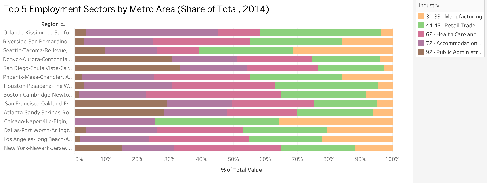
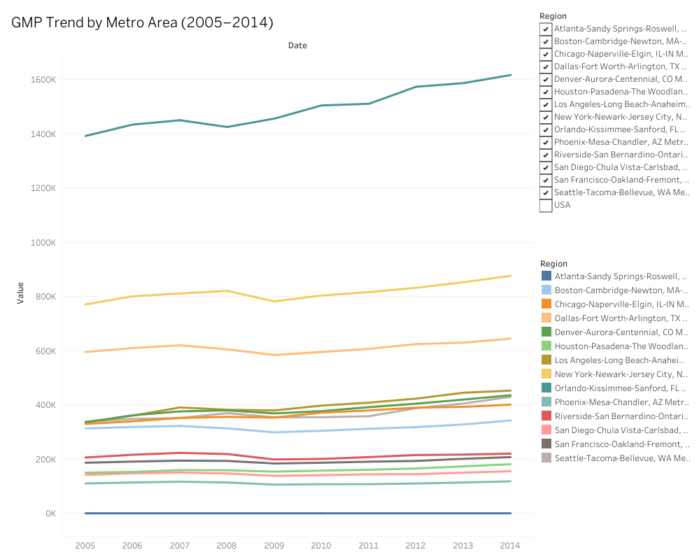
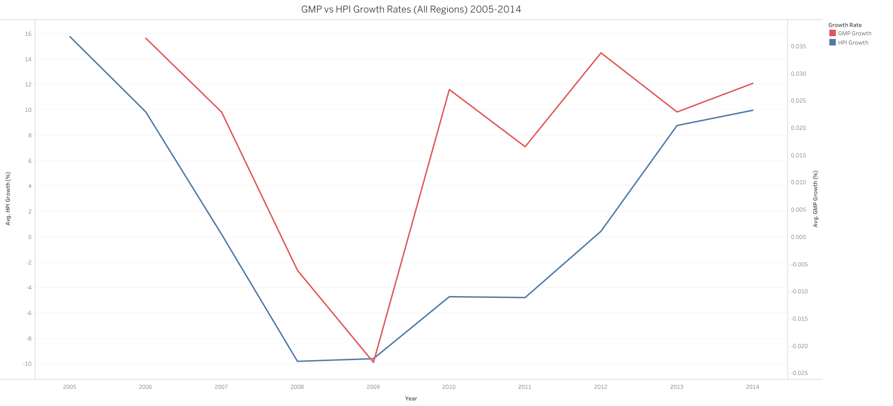
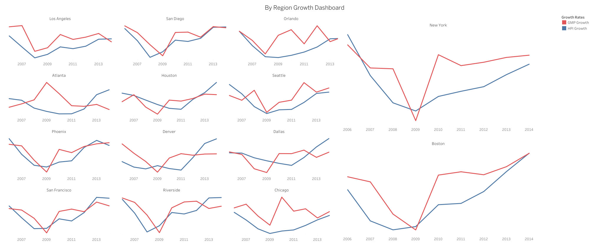

# Software-Tools-Group-1-Project
# Group-Project Final Report 
Group: Grant Hanauer, Nicholas Hoffman, Aurora Seekins, and Hannah Farrell

## Introduction 
A real estate developer is considering opportunities for future investment. For the purposes of this report, the real estate developer is Eagles Real Estate Developers. They are a Boston based firm but operate nationally.

Eagles Real Estate Developers has already isolated GDP per capita aggregated by Metropolitan Statistical Area (MSA) level to be a key indicator of long-run performance. Currently the firm lacks a means to forecast GDP per capita but is capable of monitoring employment trends as a guide to future metro level performance. The firm seeks to understand what key employment categories (NAICS-2 Digit) will drive metro level GDP growth and what are the trends are for those employment categories in major MSAs. The firm will utilize this information as a reasonable estimate of likely property value increases in the area based on perceived economic development and growth, and it intends to decide which MSAs to make its largest investments in based on this data.

To better inform our analysis and recommendations, and particularly because of housing market volatility following the Great Recession and its aftermath, we will also briefly examine trends in housing prices to ascertain the potential correlation between increased area output (GMP) and property values. 

The central research question that the analysis in this report seeks to answer is: Where should Eagles Real Estate Developers invest, based on the regional labor markets and economic indicators (GDP and employment)?

## Data  

The primary data our team is utilizing for this research was sourced indirectly from the Bureau of Economic Analysis (BEA), Bureau of Labor Statistics (BLS), and the US Census Bureau through Federal Reserve Economic Data (FRED) from 2005-2014. GDP (and GMP), Population, Unemployment Rate, Total Employment, Employment by NAICS 2 Digit Category, and other potential variables for Major MSAs were extracted from FRED. The data includes information for fourteen (14) major metro areas as well as the United States as a whole, including metro areas from the following states; Georgia, Massachusetts & New Hampshire, Illinois & Indiana, Texas, Colorado, Michigan, California, Florida, Minnesota & Wisconsin, New York & New Jersey, Pennsylvania & Maryland & Delaware, Arizona, Washington, and Washington DC & Virginia & West Virginia and Maryland.

While performing the analysis that the firm has asked us to complete, we realized that employment and output data, as well as property values, may be reactive to economic shocks, such as the Great Recession.  To best inform our client, we suggested (and the firm approved) using an excursion dataset of Federal Housing Finance Agency (FHFA) from the same period to examine whether metro areas with strong employment-driven GMP growth also experience higher housing price appreciation, providing additional context for Eagles Real Estate Developers. The FHFA data serves as an excellent compliment to our existing data because: a) It is also available through FRED, which ensures the definition of metropolitan area and formatting is as close as possible; b) the data is reliable and government-backed; and c) the data uses repeated sales of the same property, which accurately shows housing price appreciation. Notably, this data is not perfectly comparable. We use the largest MSADs (Metropolitan Statistical Area Division) to estimate the data on half of the observed MSAs (Boston, Chicago, Dallas, Los Angeles, New York, San Francisco, and Seattle). This data provides an indicator of housing price trends by analyzing data on single-family home purchases using Housing Price Index (HPI) to standardize housing price trends against inflation, with 100 as a baseline value collected from 1980. 

The primary employment and output data mentioned above has four main variables; Date, Region, Industry, and Value. The key employment categories (or industries) we observe utilize the NAICS-2 Digit code as identifier. Our data also contains each MSAs population size, employment broken down by sector, unemployment rate, and GMP. The value listed for each column is the specific value. Table 1 provides a breakdown of the units and description for each of the variables used in the main dataset for this report.

**Table 1. Dataset Variable Descriptions**
| Metric | Units | Description |
|--------|-------|-------------|
| Employment - 21 - Mining, Quarrying, and Oil and Gas Extraction | Thousands of Persons | Measures the number of employees (in thousands) working in the broader mining, quarrying, oil, and gas industry sector as defined by the North American Industrial Classification System (NAICS). Raw data source: U.S. Bureau of Labor Statistics (BLS) State and Area Employment, Hours, and Earnings dataset via FRED. |
| Employment - 22 - Utilities | Thousands of Persons | Measures the number of employees (in thousands) working in the utilities industry sector as defined by the North American Industrial Classification System (NAICS). Raw data source: U.S. Bureau of Labor Statistics (BLS) State and Area Employment, Hours, and Earnings dataset via FRED. |
| Employment - 23 - Construction | Thousands of Persons | Measures the number of employees (in thousands) working in the construction sector as defined by the North American Industrial Classification System (NAICS). Raw data source: U.S. Bureau of Labor Statistics (BLS) State and Area Employment, Hours, and Earnings dataset via FRED. |
| Employment - 31-33 - Manufacturing | Thousands of Persons | Measures the number of employees (in thousands) working in manufacturing as defined by the North American Industrial Classification System (NAICS). Raw data source: U.S. Bureau of Labor Statistics (BLS) State and Area Employment, Hours, and Earnings dataset via FRED. |
| Employment - 42 - Wholesale Trade | Thousands of Persons | Measures the number of employees (in thousands) working in the wholesale trade industry sector as defined by the North American Industrial Classification System (NAICS). Raw data source: BLS via FRED. |
| Employment - 44-45 - Retail Trade | Thousands of Persons | Measures the number of employees (in thousands) working in the retail trade industry sector as defined by NAICS. Raw data source: BLS via FRED. |
| Employment - 48-49 - Transportation and Warehousing | Thousands of Persons | Measures the number of employees (in thousands) working in logistics (transportation and warehousing) sector as defined by NAICS. Raw data source: BLS via FRED. |
| Employment - 51 - Information | Thousands of Persons | Measures the number of employees (in thousands) working in the information sector as defined by NAICS. Raw data source: BLS via FRED. |
| Employment - 52 - Finance and Insurance | Thousands of Persons | Measures the number of employees (in thousands) working in financial services and insurance sector as defined by NAICS. Raw data source: BLS via FRED. |
| Employment - 53 - Real Estate and Rental and Leasing | Thousands of Persons | Measures the number of employees (in thousands) working in real estate and rental/leasing sector as defined by NAICS. Raw data source: BLS via FRED. |
| Employment - 54 - Professional, Scientific, and Technical Services | Thousands of Persons | Measures the number of employees (in thousands) working in professional, scientific, and technical services sectors as defined by NAICS. Raw data source: BLS via FRED. |
| Employment - 55 - Management of Companies and Enterprises | Thousands of Persons | Measures the number of employees (in thousands) working in management of companies sector as defined by NAICS. Raw data source: BLS via FRED. |
| Employment - 61 - Educational Services | Thousands of Persons | Measures the number of employees (in thousands) working in educational services as defined by NAICS. Raw data source: BLS via FRED. |
| Employment - 62 - Health Care and Social Assistance | Thousands of Persons | Measures the number of employees (in thousands) working in health care and social assistance as defined by NAICS. Raw data source: BLS via FRED. |
| Employment - 71 - Arts, Entertainment, and Recreation | Thousands of Persons | Measures the number of employees (in thousands) working in arts, entertainment, and recreation as defined by NAICS. Raw data source: BLS via FRED. |
| Employment - 72 - Accommodation and Food Services | Thousands of Persons | Measures the number of employees (in thousands) working in accommodation and food services industry as defined by NAICS. Raw data source: BLS via FRED. |
| Employment - 81 - Other Services (except Public Administration) | Thousands of Persons | Measures employment in miscellaneous private-sector services not classified elsewhere under NAICS. Raw data source: BLS via FRED. |
| Employment - 92 - Public Administration | Thousands of Persons | Measures employment in government (state, local, federal) under NAICS. Raw data source: BLS via FRED. |
| Total Employment | Thousands of Persons | Total number of employed persons across all industries in the geographic area. Raw data source: BLS LAUS via FRED. |
| Unemployment Rate | Percent (Not Seasonally Adjusted) | Share of labor force that is unemployed but actively seeking work. Raw data source: BLS LAUS via FRED. |
| Gross Metro Product (GMP) | Millions of Chained 2017 Dollars (Not Seasonally Adjusted) | Total economic output of a metropolitan area. Raw data source: BEA via FRED. |
| US GDP (GDPC1) | Billions of Chained 2017 Dollars (Seasonally Adjusted) | Real GDP of the United States. Raw data source: BEA via FRED. |
| Population | Thousands of Persons | Total resident population of the geographic area. Raw data source: U.S. Census Bureau via FRED. |

## Summary Tables

Here we include a series of tables to summarize our data for additional context.
 
### Brief Data Summary: Primary Data - Economic Indicators by Region

**Table 2. Dataset Dimensions**

There are 4 rows and 3290 columns in the dataset.

**Table 3. Summary Statistics for Employment Values(Thousands of People)**

 

**Table 4. Distribution of Total Employment by Region** 

**Table 5. Summary Statistics for Industry Employment**

Table 5 inclues the summary statitics by industry across all of the regions broken down by employment category. 

**Table 6. Summary Statistics for Macro Variables**

### Brief Data Summary: Excursion Data - Housing Price Indicators (HPI) by Region

**Table 7. Housing Price Index (HPI) Dataset Dimensions**

There are 150 rows and 6 columns in hte excusion dataset.

**Table 8. Summary Statistics for for Housing Price Index**
 
 

**Table 9. Summary Statistics for Annual FHFA HPI and Annual HPI Growth by Region**

|Region                                          | HPI Mean| HPI Median| HPI SD| HPI Min| HPI Max| HPI Growth Mean| HPI Growth Median| HPI Growth SD| HPI Growth Min| HPI Growth Max|
|:-----------------------------------------------|--------:|----------:|------:|-------:|-------:|---------------:|-----------------:|-------------:|--------------:|--------------:|
|Atlanta-Sandy Springs-Roswell, GA Metro Area    |   159.48|     160.13|  17.11|  134.13|  181.42|           -0.35|             -0.78|          6.24|          -7.74|           9.55|
|Boston-Cambridge-Newton, MA-NH Metro Area       |   242.60|     238.09|  16.73|  225.38|  268.31|           -0.03|             -0.82|          4.48|          -5.10|           8.90|
|Chicago-Naperville-Elgin, IL-IN Metro Area      |   173.35|     169.16|  22.22|  147.88|  204.50|           -0.62|             -0.85|          6.69|          -9.12|          10.71|
|Dallas-Fort Worth-Arlington, TX Metro Area      |   164.24|     162.88|   8.30|  153.94|  184.56|            2.18|              2.02|          3.20|          -2.02|           8.72|
|Denver-Aurora-Centennial, CO Metro Area         |   193.98|     192.05|  11.25|  181.48|  221.50|            1.77|              0.20|          4.35|          -2.34|          10.01|
|Houston-Pasadena-The Woodlands, TX Metro Area   |   184.95|     183.91|  15.21|  161.76|  218.66|            3.59|              3.83|          3.61|          -1.39|          10.58|
|Los Angeles-Long Beach-Anaheim, CA Metro Area   |   264.88|     257.03|  42.40|  221.10|  335.17|            2.38|             -0.75|         13.20|         -18.51|          24.30|
|New York-Newark-Jersey City, NY-NJ Metro Area   |   241.51|     235.99|  17.19|  222.96|  268.78|            1.09|             -0.39|          6.71|          -6.29|          15.77|
|Orlando-Kissimmee-Sanford, FL Metro Area        |   199.29|     184.55|  48.28|  146.64|  273.24|            1.09|             -0.86|         15.58|         -17.05|          27.18|
|Phoenix-Mesa-Chandler, AZ Metro Area            |   209.93|     197.87|  50.25|  146.89|  288.41|            2.83|              3.10|         17.99|         -19.62|          33.47|
|Riverside-San Bernardino-Ontario, CA Metro Area |   226.87|     209.62|  62.08|  166.99|  328.02|            1.13|             -1.60|         16.90|         -28.15|          24.78|
|San Diego-Chula Vista-Carlsbad, CA Metro Area   |   226.87|     209.62|  62.08|  166.99|  328.02|            1.13|             -1.60|         16.90|         -28.15|          24.78|
|San Francisco-Oakland-Fremont, CA Metro Area    |   276.76|     279.56|  27.94|  240.89|  318.26|            3.26|              0.86|          9.74|          -8.86|          19.20|
|Seattle-Tacoma-Bellevue, WA Metro Area          |   233.66|     229.43|  22.48|  206.74|  270.70|            3.02|              3.87|          9.38|          -9.77|          15.91|
|USA                                             |   340.53|     338.55|  23.81|  311.12|  377.64|            0.94|              0.42|          5.78|          -5.55|          11.35|

## Data Analytics

The visualizations provide a comparative view of economic structure and performance across major U.S. metropolitan areas using employment composition, output (GMP), and labor market indicators. The metro comparison table highlights large differences in economic scale across regions. New York stands out with the highest GMP (around 1.6 million), followed by Los Angeles and Chicago, indicating their dominant role in national economic output. However, unemployment rates do not scale directly with size. For example, Chicago and Riverside both show higher unemployment rates near 9 percent, while Seattle has the lowest at around 5 percent despite a smaller overall economy. This suggests that labor market efficiency is not solely dependent on economic size.

The GMP growth visualization from 2005 to 2014 shows that all metros experienced a decline around 2008–2009, consistent with the financial crisis. Recovery patterns differ across regions. Larger metros such as New York and Los Angeles demonstrate strong and steady post-recession growth, while smaller metros like Orlando and Riverside recover more slowly. This indicates that larger and more diversified economies may be more resilient to economic shocks.

The top five employment sectors chart shows that most metros are dominated by service-based industries, particularly retail trade, healthcare, and accommodation-related sectors. There are still meaningful differences in structure. Some metros, such as Seattle and San Francisco, appear more balanced across industries, while others, including Orlando, are more concentrated in a smaller number of sectors. Greater concentration may increase vulnerability if those industries experience downturns.

The bottom five employment sectors chart reinforces this pattern by showing consistently low representation in industries such as mining, utilities, and management. While these sectors are small across all metros, slight variation still exists, and regions with more diversification even among smaller sectors may have added economic stability.

Based on the combined analysis, Seattle-Tacoma-Bellevue is a strong candidate for further exploration. It has the lowest unemployment rate among the metros shown and demonstrates steady GMP growth over time. Its employment distribution also appears more balanced compared to more concentrated metros such as Orlando or Riverside. This combination of low unemployment, consistent growth, and diversification suggests a more stable and resilient economic structure.

Tableau was effective for transforming complex datasets into clear and interpretable visualizations. The ability to build stacked bar charts and dashboards made it easier to compare metros and identify patterns across multiple variables. Filtering and visual interaction improved clarity when working with multiple regions. However, the process required careful data preparation, particularly converting the dataset into long format. Managing multiple metrics within the same workflow also introduced challenges, as small inconsistencies in formatting or data alignment could affect results and required close attention during validation. Notably a person cannot collaborate in the public dashboard, so all changes or additions must be filtered through the person who publishes the dashboard.

### Tableau Dashboard

The Tableau dashboard was developed to provide a structured, visual analysis of metro-level economic performance and industry composition across major U.S. metropolitan areas. Four primary visualizations were constructed. First, stacked bar charts of the top five and bottom five industries by metro area were created using percent of total employment. This approach standardizes across regions of different sizes and highlights relative industry importance rather than absolute scale. Second, a line chart of Gross Metropolitan Product (GMP) over time (2005–2014) was used to capture differences in economic growth trajectories and to illustrate how metros responded to broader economic shifts over the period. Third, a metro comparison table was built to display key indicators, GMP, population, total employment, and unemployment rate, for each metro in 2014. Because the dataset was originally in long format, the data was restructured within Tableau by pivoting the Industry variable into columns, allowing each metric to be presented clearly and consistently.

Together, these visualizations provide complementary insights into both the structure and performance of metropolitan economies. The industry composition charts identify which sectors dominate or lag within each metro, offering insight into the underlying economic base. The GMP trend visualization adds a temporal dimension, revealing which regions experienced stronger or more stable growth over time. The comparison table provides a clear snapshot of economic scale and labor market conditions, allowing for direct cross-metro comparison. By combining these elements into a single interactive dashboard, the analysis enables a more comprehensive evaluation of regional economic strength and supports the identification of metros with characteristics that may be more favorable for long-term real estate investment.

The primary data analysis we performed here was on the economic indicators, as the firm is utilizing this part of the analysis to understand MSA economic performance. The excursion was somewhat useful for contextualizing how these economic indicators are correlated with immediate property value changes. Though our primary dataset was comprehensive for the 2005-2014 period, that period also included the Great Recession, which saw erratic property value data that deviated as the economy grappled with how to recover. The graph “GMP vs HPI Growth Rates (All Regions) 2005-2014” shows how linked the trends between GMP and HPI were during this time, with the cratering trend of GMP almost exactly mirroring the HPI trend one year earlier.  However, encouragingly trends seem to follow each other as the recovery from the recession began to stabilize, and the last 1 to 2 years of our dataset saw trends that began to closely resemble each other in GMP and HPI growth.  The dashboard “GMP Growth vs HPI Growth By Region” seeks to capture this trend in each region by organizing the graphs left-to-right by both their correlation and positive GMP growth in the last two years of observation to try to understand which MSA property values respond most reliably to trends in GMP during this time as an indicator of future performance. 

### Top 5 Employment Sectors by Metro Area

### Bottom 5 Employment Sectors by Metro Area

### GMP Trend by Metro Area

### Metro Comparison Table

### GMP vs HPI Growth Rates (All Regions) 2005-2014

### GMP VS HPI Growth Rates By Region 2012-2014

## Employment Growth Rates by Industry 

## Macro Economic Growth Trends 

 

## Conclusion (10 pts)

_Summarize the analytical methodology and provide closure to your analytical story. Succinctly answer the research questions. Highlight the limitations of your findings and recommend future work. Do not make policy recommendations here._

## Limitations

There are some limitations to the reports analysis provided. While the data covers different major US metro regions, it is not comprehensive to cover all metro regions. There could be additional rural or suburban areas that could be profitable to invest in. 

Furthermore, the data provides only a small snapshot into the historical data available. Given the data limitations that resulted in the data being from 2004-2015, the data is slightly outdated. The 2008 recession is also in the middle of this dataset which caused a negative impact to both the housing market and the general economy at the time. The impact of the recession on the different metro regions would skew the data. This could mean that the regions that had the highest growth in the job market and strong economic growth as seen in the macro variable analysis could have changed over the last ten years. 

An additional limitation is that there are additional variables outside of the data used within the report that impact the success of real estate developers. For example, permitting and zoning laws play a large role in the ability to add developments, the type of developments and where the siting could occur. All of these factors impact the ability to generate the additional housing supply and also impact the desirability of the housing to be added. In the housing market where Eagles Real Estate Developers is sited for example, the addition of multi-family housing has been increased in recent years in Boston as a result of policy decisions. The MBTA Communities Act was a zoning policy that allowed for an increase in multi-family homes near commuter stations (https://www.mass.gov/info-details/multi-family-zoning-requirement-for-mbta-communities). Policies such as these could not be captured through this data analysis.

## Future Work

Future work could expand this analysis by incorporating more recent data to capture current economic trends. The impact of the 2020 coronavirus pandemic on the economic growth would be better captured with more recent data. Following the pandemic there has also been a shift in where people live and work, many people moving away from more urban areas. This shift in where and how people live could lead to a difference in where the firm should invest. Looking at the type of real estate to invest in also may have shifted. This was not something that our report looked into but could also be helpful for the firm to investigate, commercial versus residential investments as these may vary by the region as well. Adding more housing market data would also strengthen the connection between economic performance and real estate investment decisions.

Additionally, applying econometric techniques could help identify which employment sectors are the strongest predictors of GMP growth. Expanding the dataset to include more metropolitan areas or even international comparisons could also provide a broader perspective. With a larger dataset the firm would see if investing in regions in Canada or South America could also be profitable for them. 

## Policy Recommendation

Eagles Real Estate Developers should focus most of its investment on metropolitan areas that have a diverse mix of industries and show steady GMP growth over time, while still putting a smaller portion of its money into faster-growing but more volatile cities. Metros like Boston, San Francisco, and New York stand out because they have balanced employment across sectors, consistent economic growth, and relatively stable unemployment rates. These factors suggest that demand for real estate in these areas is more likely to remain strong over time and less affected by downturns in any single industry. Boston and New York in particular also saw multi-year alignment in their property value increases with GMP trends, suggesting that the methodology used here to determine value growth is especially potent in those two MSAs. San Francisco also saw this alignment, which is encouraging, but began to see a slight downward trend in GMP growth in the last year of our observed time period. At the same time, cities like Orlando or Phoenix show higher growth potential but also more volatility which , so investing in them at a smaller scale allows the firm to take advantage of potential gains without taking on too much risk.

This strategy helps create a more stable overall portfolio by reducing exposure to economic shocks and supporting long-term returns. However, there are tradeoffs. Focusing on stable metros may mean missing out on higher returns in faster-growing cities, and larger, well-established metros often have higher costs of entry. In addition, both types of metros can still be affected by broader economic downturns. Overall, this approach balances risk and return by combining reliable markets with some exposure to higher-growth opportunities, using the employment and GMP data to guide more informed investment decisions.
